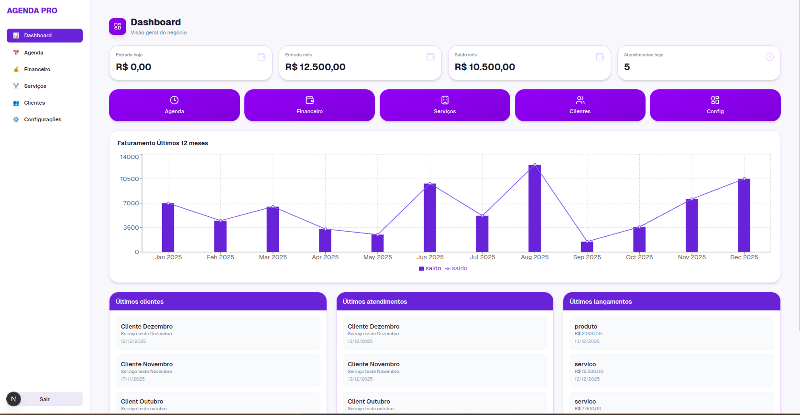
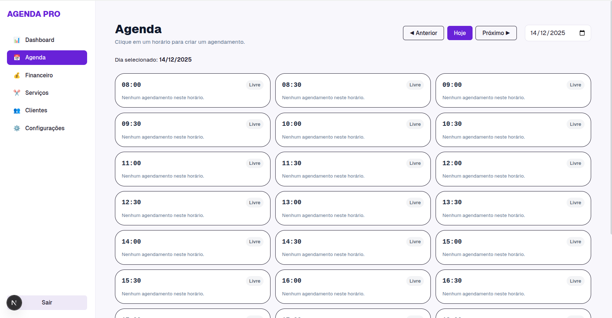
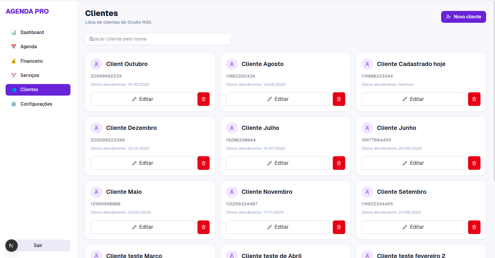
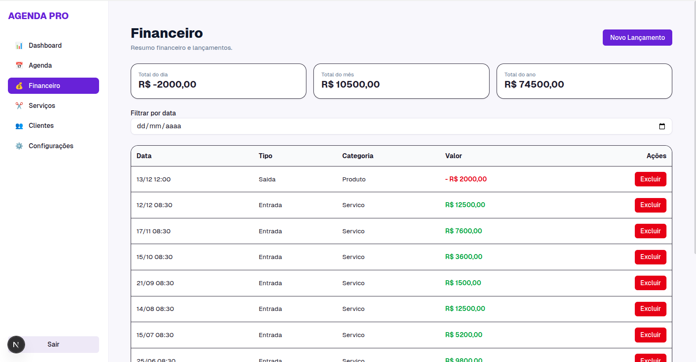
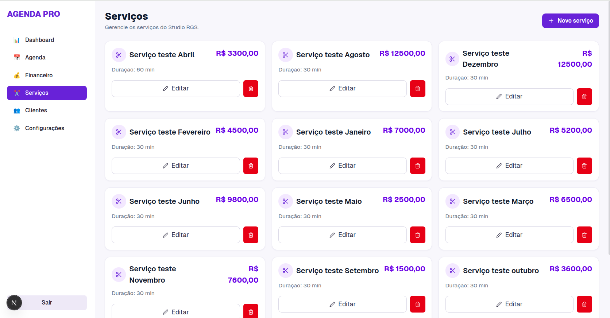
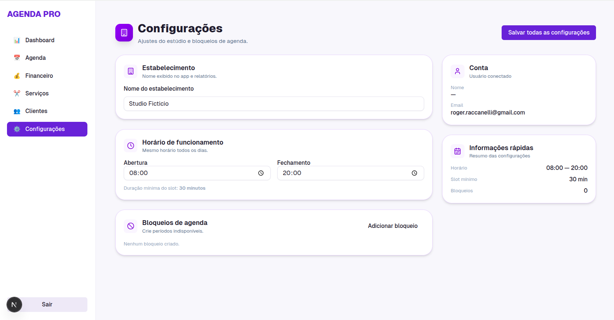

📌 Agenda PRO — Sistema de Agendamento e Gestão Básica

## 🔑 Acesso de demonstração
Este projeto possui um usuário de demonstração para facilitar a avaliação:
Email: demo@agenda-pro.dev  
Senha: demo123456

Aplicação full-stack desenvolvida como projeto de portfólio, com foco em praticar e demonstrar conceitos de frontend moderno, integração com backend e persistência de dados em tempo real.

O sistema simula a rotina de profissionais como cabeleireiros, manicures e prestadores de serviço, incluindo agenda, controle financeiro simples, cadastro de clientes e dashboard.

🚀 Tecnologias utilizadas

Next.js 14 (App Router)

React

TypeScript

TailwindCSS

Shadcn UI

Firebase Authentication

Firestore Database

Recharts

Layout responsivo (desktop e mobile)

🗂️ Funcionalidades implementadas
📅 Agenda

Grade de horários dinâmica (08h–20h)

Criação de agendamentos com:

Nome

Telefone

Serviço

Duração

Detecção automática de conflito de horários

Edição e exclusão de agendamentos

Marcação de atendimento como concluído

Conclusão gera lançamento financeiro automaticamente

💰 Financeiro

Registro automático de entradas ao concluir serviços

Listagem cronológica

Valores formatados em moeda (BRL)

👥 Clientes

Cadastro automático ao concluir atendimentos

Atualização da última visita

Listagem simples e objetiva

🛠️ Serviços

Cadastro de serviços com:

Nome

Preço

Duração

Utilizados diretamente na agenda e no financeiro

📊 Dashboard

Indicadores rápidos (KPIs)

Total faturado no mês

Número de atendimentos concluídos

Gráfico de faturamento mensal

📱 Responsividade

Sidebar no desktop

Bottom navigation no mobile

Layout focado em usabilidade

## 📸 Screenshots

### Dashboard

### Agenda

### Clientes

### Financeiro

### Serviços

### Configurações

🧱 Estrutura do projeto (resumo)
app/
 └── (private)/
      ├── dashboard
      ├── agenda
      ├── finances
      ├── services
      ├── clientes
      ├── config
      └── layout.tsx
components/
lib/firebase.ts

🔐 Autenticação

Autenticação feita com Firebase Authentication (Email/Senha).
As rotas privadas são protegidas por um layout que valida o estado de autenticação do usuário.

🧮 Firestore — Estrutura de dados
users/{uid}/services/{serviceId}
users/{uid}/clients/{clientId}
users/{uid}/appointments/{appointmentId}
users/{uid}/finances/{financeId}

▶️ Como rodar o projeto localmente
git clone https://github.com/rogerraccanelli/agenda-pro.git
cd agenda-pro
npm install

Crie o arquivo .env.local com suas credenciais do Firebase.

npm run dev

Acesse:

http://localhost:3000

🧑‍💻 Observações

Este projeto foi desenvolvido com foco em:

Prática de CRUD real com Firebase

Gerenciamento de estado assíncrono

Organização de rotas com App Router

Componentização e reutilização de UI

Integração entre módulos (agenda → financeiro)

Boas práticas iniciais de projeto frontend

📝 Licença

Uso livre para fins de estudo e portfólio.